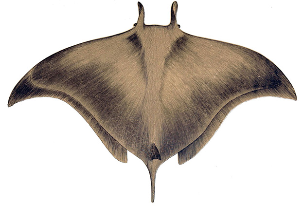

Devilfish
=========

Devilfish is an archiving utility for use with [DEVONthink Pro](http://www.devontechnologies.com/products/devonthink/overview.html). It simultaneously creates a single-page PDF snapshot of a web page and a local web archive of the page, and sends requests to external sites such as the [Internet Archive](https://archive.org/).

*Author*:      [Michael Hucka](http://github.com/mhucka) 
*Repository*:   [https://github.com/mhucka/devilfish](https://github.com/mhucka/devilfish) 
*License*:      Unless otherwise noted, this content is licensed under the [MIT License](https://opensource.org/licenses/MIT) license.

☀ Introduction
-----------------------------

Web pages are ephemeral&mdash;here today, gone (or worse, _changed_) tomorrow.  For researchers, this is anathema: we need to be able to document exactly what we read, when we read it, and potentially prove it at a later time.  Currently the best web archiving facilities for general use are sites such as the [Internet Archive](https://archive.org), [WebCite](http://www.webcitation.org), and [Archive.today](https://archive.is), but for convenience and rapid access, keeping one's own local archives is a necessity.  One of the research tools I use is [DEVONthink Pro](http://www.devontechnologies.com/products/devonthink/overview.html), a personal database and information management system for macOS, and I needed a convenient way to store not only an archive of a web page but also a page snapshot in PDF format.  Devilfish is my solution.

Devilfish is meant to be bound to a keyboard shortcut and invoked while browsing the web in Safari or Google Chrome.  When invoked, it does the following:

* Prompts the user for a destination database in DEVONthink&nbsp;Pro and for a list of tags
* Calls on DEVONthink&nbsp;Pro to create an archive of the current page in [webarchive](https://en.wikipedia.org/wiki/Webarchive) format
* Calls on DEVONthink&nbsp;Pro to create a single-page PDF of the current page
* Optionally, sends requests via network API to the [Internet Archive](https://archive.org), [WebCite](http://www.webcitation.org), and [Archive.today](https://archive.is)

The web archive is not stored in DEVONthink Pro but rather in a folder in the user's home directory.  The PDF is left in DEVONthink; the URL of the web page is stored in the document's URL field, and the PDF is annotated with a Spotlight comment containing the path to the (external) web archive file.  This combination avoids duplication and excessive growth in the user's DEVONthink database, while still allowing the user to take advantage of DEVONthink's powerful full-text PDF search, annotation, and other capabilities, and to have a backup copy of the original page source as a precaution.  The web archive storage location can be placed on an external drive, or an [IPFS](https://ipfs.io) location, or other location.

The name "Devilfish" for this software is inspired by loosely combining "DEVONthink" and "fishing", as in fishing for information.  (By the way, the real [devil fish](https://www.tethys.org/activities-overview/research/devil-rays/)&mdash;more properly known as _Mobula mobular_ or the giant devil ray&mdash;is an [endangered species](http://www.iucnredlist.org/details/39418/0) due to [fishing](http://journals.plos.org/plosone/article?id=10.1371/journal.pone.0141189) and habitat destruction.  Please [read more about them](http://www.dw.com/en/manta-rays-drive-global-conservation-efforts/a-17550976) to become more informed and help preservation efforts before they are driven to extinction.)

⁇ Getting help and support
--------------------------

If you find an issue, please submit it in [the GitHub issue tracker](https://github.com/mhucka/devilfish/issues) for this repository.

♬ Contributing &mdash; info for developers
------------------------------------------

I would be happy to receive your help and participation if you are interested.  Everyone is asked to read and respect the [code of conduct](CONDUCT.md) when participating in this project.

🏛 Copyright and license
---------------------

Copyright (c) 2018 by Michael Hucka and the California Institute of
Technology.

☺ Acknowledgments
-----------------------

The image of the illustration of a giant devil ray used on this page [came from Wikimedia](https://commons.wikimedia.org/wiki/File:Mobula_mobular.jpg). It was originally created by H. Gervais for the 1877 book _[Les Poissons](https://archive.org/details/lespoissonssynon03gerv)_ by H. Gervais and R. Boulart.
